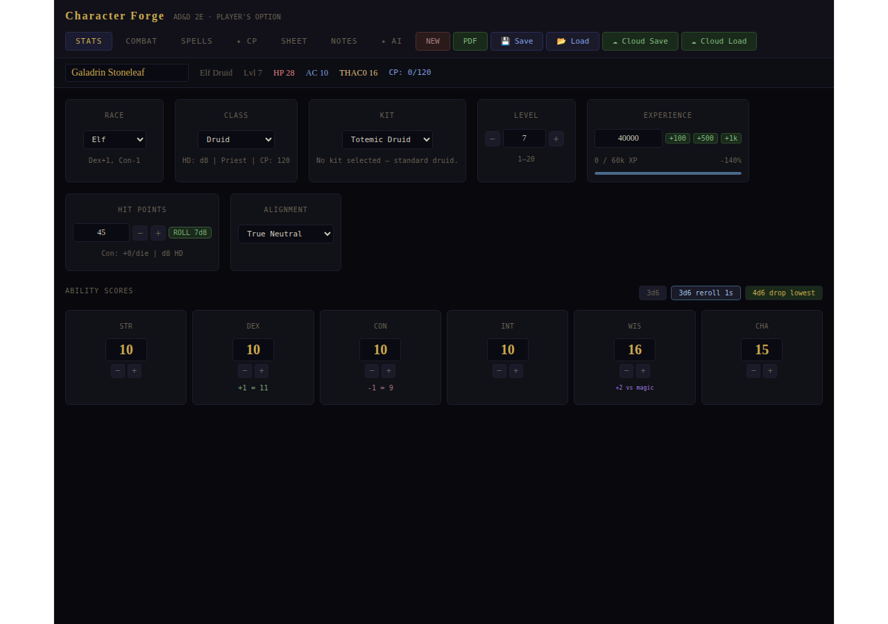
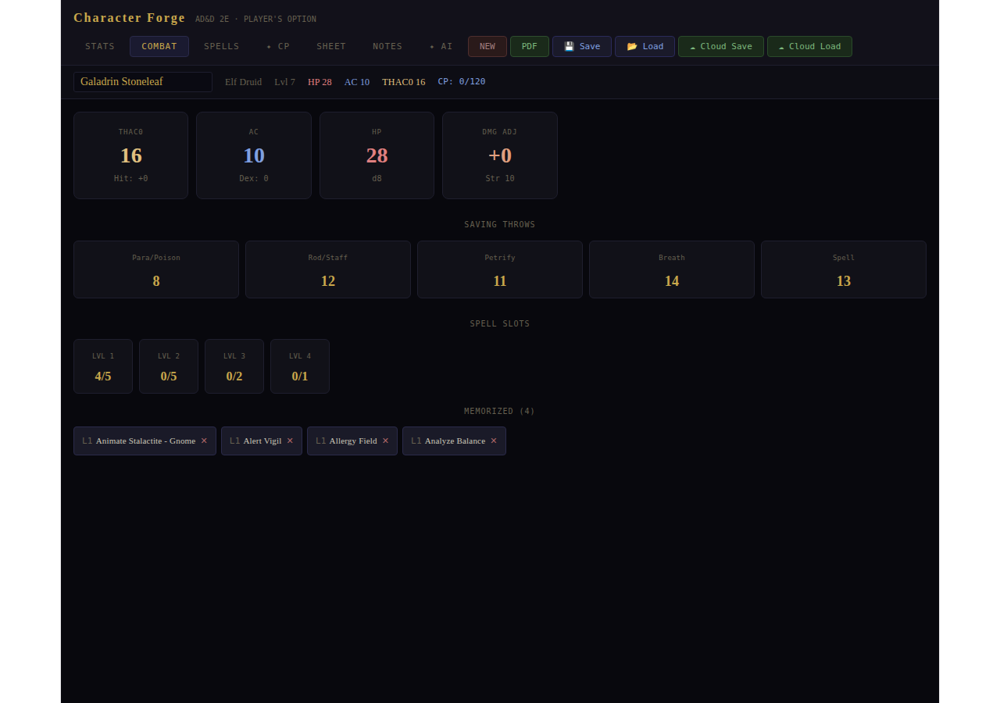
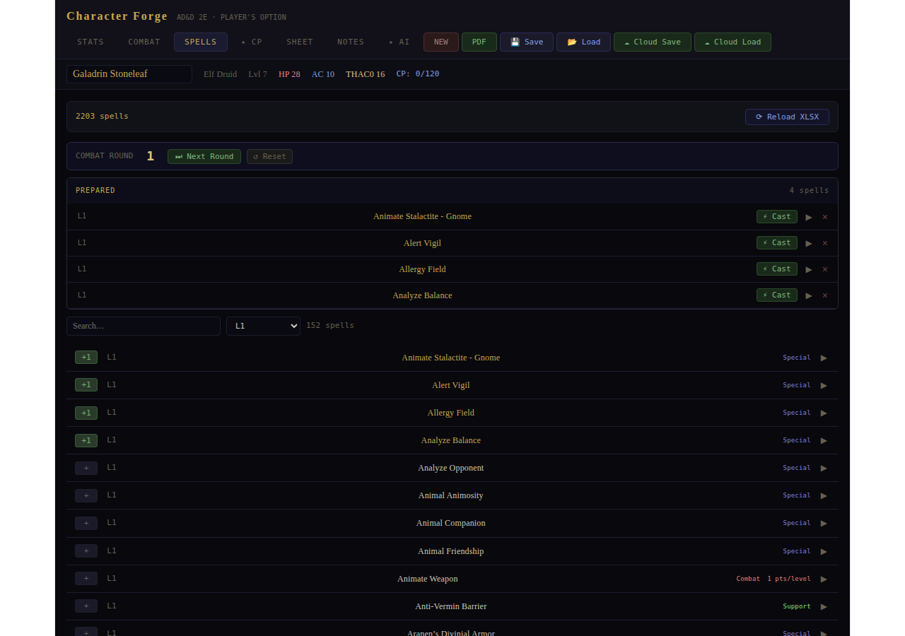
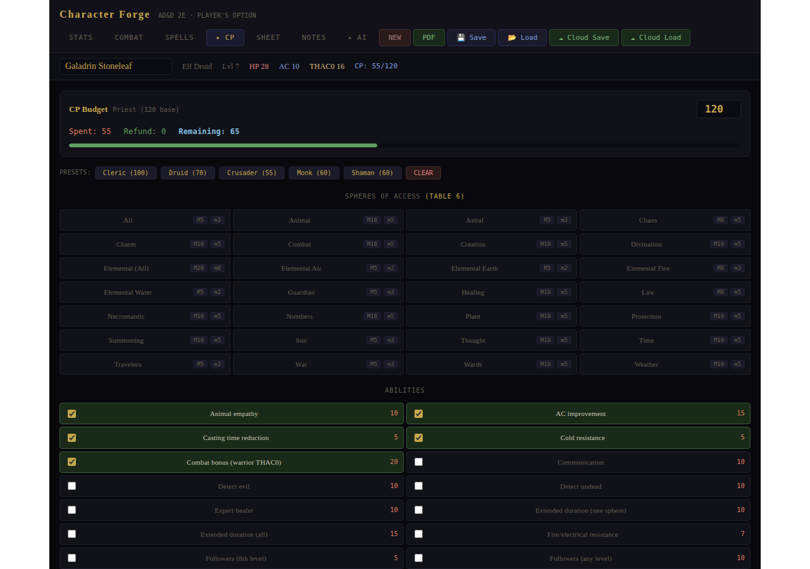
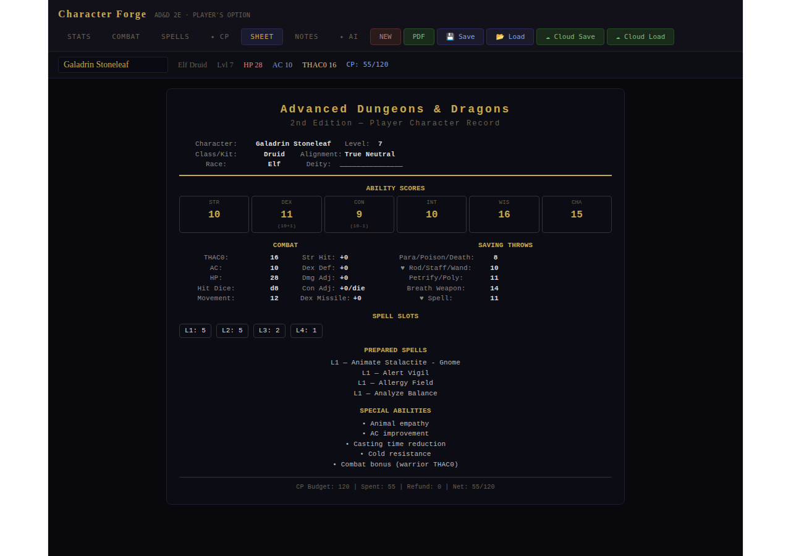
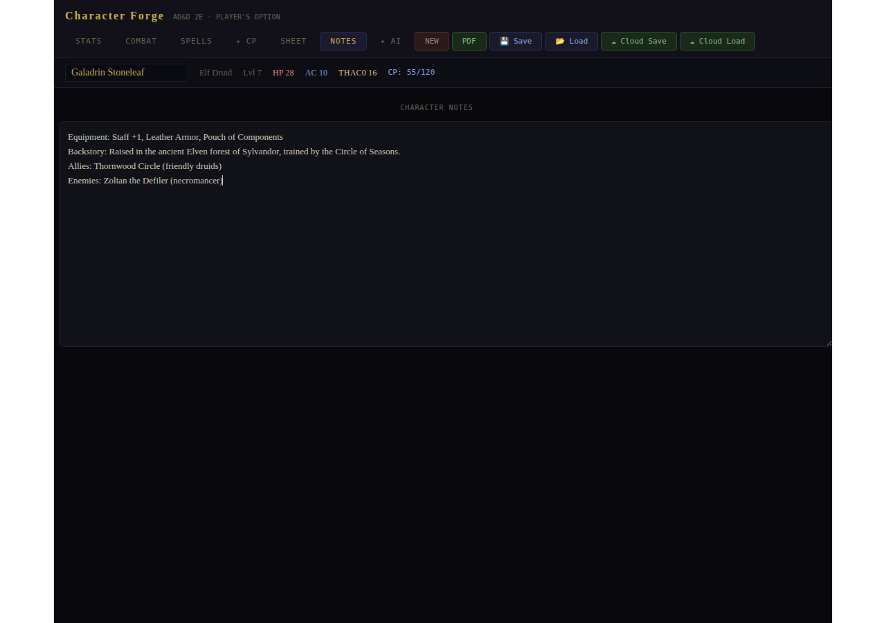
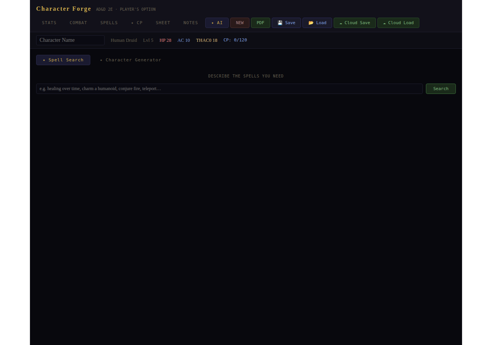

# Character Forge — Feature Guide

**AD&D 2nd Edition character tool** · Works on desktop & mobile · Auto-saves to your browser

---

## The Header

The top bar is always visible regardless of which tab you're on. It shows your character's **name, race, class, level, HP, AC, THAC0, and CP** at a glance — all updating live as you edit. The tab row lets you switch between the seven sections. **NEW** clears everything for a fresh character. **PDF** exports a printable character sheet. **💾 Save** downloads a `.json` backup. **📂 Load** restores from a `.json` file or imports a Character Forge PDF. **☁ Cloud Save / Cloud Load** sync to Supabase cloud storage when configured.

---

## Tab 1 — Stats

The main character creation tab. Set **Race** and **Class** from the dropdowns — racial stat adjustments appear automatically below the race selector. Set a **Kit** (Druid-specific dropdown or free-text for other classes). Adjust **Level** with the −/+ buttons or type directly. The **Experience** card shows your current XP, the threshold for the next level, a progress bar, and quick-add buttons (+100, +500, +1k). **Hit Points** can be typed or nudged with −/+, and the **ROLL** button rolls hit dice × level automatically. The six **Ability Score** cards each show their mechanical effect (to-hit bonus, AC adjustment, HP per die, saving throw bonus, bonus spells). Three rolling methods are available: **3d6**, **3d6 reroll 1s**, and **4d6 drop lowest** — results open in an assignment modal where you drag-and-drop each roll to a stat.

---

## Tab 2 — Combat

A read-only reference panel — everything is calculated automatically from your stats and level. **THAC0** is derived from class and level. **AC** starts at 10 and adjusts for DEX. **DMG ADJ** comes from STR. The five **Saving Throws** (Paralysis/Poison, Rod/Staff, Petrify, Breath, Spell) are looked up from the PHB tables for your class and level. **Spell Slots** show used/available for each spell level in real time, turning red when a level is full. **Memorized** lists every prepared spell as a removable tag — click × to un-prepare one.

---

## Tab 3 — Spells

The spell management center. The **Prepared** section at the top lists your memorized spells; click **⚡ Cast** to expend a slot instantly or choose **Track** to start a round-by-round countdown in the Active Spells panel. The **Compendium** at the bottom holds the full 2,203-spell database filtered to your class's accessible spells. Use the **Search** box or **Level** dropdown to narrow the list, then click **[+]** to prepare a spell. Greyed-out spells mean that slot level is already full. Click any spell row to expand an AI-generated description on demand. The **⟳ Reload XLSX** button lets you load a custom homebrew spell list.

---

## Tab 4 — CP (Character Points)

Used for **Player's Option: Skills & Powers** custom class building. Priests start with 120 CP; Wizards with 40. The **Spent / Refund / Remaining** tracker and progress bar update as you make selections. **Presets** apply a pre-built configuration for common archetypes (Generic Druid, Crusader, etc.). The **Spheres of Access** section lets you pick which spheres your priest can access — Major spheres give full access, Minor spheres cap at level 3 spells. These selections automatically **filter the Spells tab** so you only see castable spells. **Special Abilities** and **Limitations** each carry a CP cost or refund. **CLEAR** resets everything.

---

## Tab 5 — Sheet

A formatted text summary of the whole character — name, race, class, kit, alignment, HP, AC, THAC0, all six ability scores with their bonuses, saving throws, spell slots, prepared spells, and notes. Useful for a quick overview or to copy-paste and share with your DM.

---

## Tab 6 — Notes

A free-text scratchpad that auto-saves with the character. Use it for equipment lists, backstory, NPC names, quest notes — anything. No formatting, just type.

---

## Tab 7 — AI

Two AI-powered tools, both requiring the Anthropic API key to be configured on the server.

**Spell Search** — describe what you need in plain English (e.g. *"best healing spells for a 5th level druid"*) and the results stream back in real time. Any spell names mentioned in **bold** are automatically highlighted in gold in the Spells tab so you can find and prepare them instantly.

**Character Generator** — switch to the Generator sub-tab, describe a concept (e.g. *"a grizzled dwarven fighter who worships a forge god"*), and click **✨ Generate**. The AI returns a full character: name, race, class, level, ability scores, alignment, HP, and a short backstory. Click **↙ Apply to Sheet** to fill everything in at once. For spellcasters, **🎲 Suggest Spells** picks thematic spells from the compendium and highlights them in the Spells tab.

---

## Saving Your Character

| Method | How | Best for |
|--------|-----|----------|
| Auto-save | Automatic, always on | Not losing work mid-session |
| 💾 Save (JSON) | Downloads a `.json` file | Backing up, moving between devices |
| 📂 Load (JSON) | Uploads the `.json` back | Restoring a backup |
| PDF Export | Downloads a `.pdf` | Printing, sharing with your DM |
| 📂 Load (PDF) | Uploads an exported PDF | Re-importing a printed sheet |
| ☁ Cloud Save | Saves to Supabase | Cross-device permanent storage |
| ☁ Cloud Load | Lists your cloud saves | Switching between characters |

> Auto-save is browser-local. Use **💾 Save** before clearing browser data or switching browsers.
